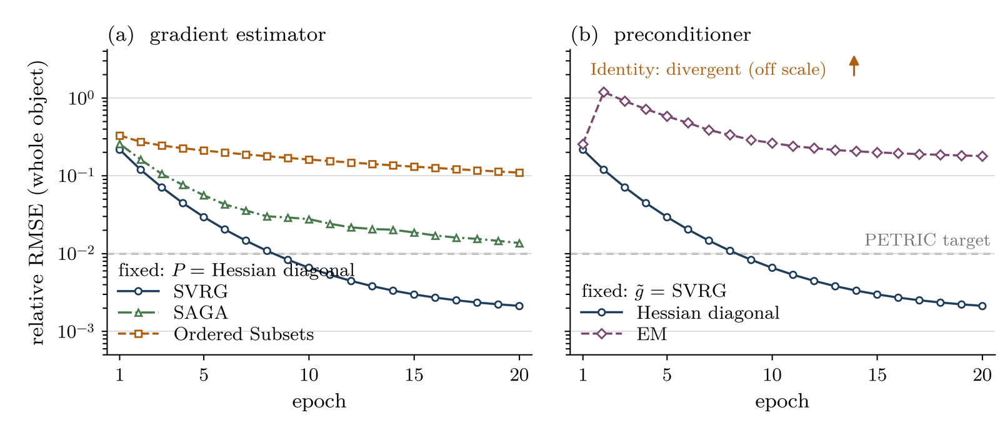

# Composable preconditioned-gradient reconstruction

This directory holds `PreconditionedGradientReconstruction` (registered name
`Preconditioned Gradient`), a reconstruction class that implements one update and delegates its
two varying ingredients — the gradient estimate and the preconditioner — to registered families
chosen at run time in the parameter file. Together with the two families in
`src/recon_buildblock/preconditioners/` and `src/recon_buildblock/gradient_estimators/`, the
locked preset `PSV` in `src/iterative/PSV/`, and the capability query
`GeneralisedPrior::provides_Hessian_diagonal()`, this is what the branch
`composable-reconstruction` adds to STIR.

Quick pointers:

- sample parameter files: `examples/samples/PreconditionedGradient_SVRG_RDP.par`,
  `PreconditionedGradient_OSEM.par`, `PreconditionedGradient_OSSPS.par`, `PSV_RDP.par`;
- test: `src/recon_test/test_PreconditionedGradient.cxx` (`ctest -R PreconditionedGradient`);
- release notes: `documentation/release_6.5.htm` (section *Reconstruction*, plus a note on the
  SWIG ≥ 4.2 requirement and its consequence for Python code);
- the update loop: `PreconditionedGradientReconstruction.cxx`, `update_estimate()`.

The rest of this file is the design rationale, written as the corresponding section of a STIR
paper.

## Motivation

The iterative algorithms of STIR — OSMAPOSL, OSSPS, and the stochastic algorithms so far
available only through the Python interface — are implemented as independent classes, each
carrying its own iteration loop, subset bookkeeping and image update, although they differ in
only two respects: how the gradient of the objective function is estimated at each
sub-iteration, and how that gradient is scaled before it is applied to the current estimate.
Adding an algorithm therefore means re-writing a loop that already exists several times over,
and combinations that the class author did not anticipate — a variance-reduced gradient with a
separable paraboloidal surrogate step size, say — cannot be expressed at all. The point became
concrete while porting the preconditioned stochastic-gradient algorithm submitted to the
[PETRIC2 challenge](https://github.com/SyneRBI/PETRIC2-Speedy) to STIR: the algorithm is a
handful of lines, none of which fitted an existing class.

## The update

Writing $\Phi(\mathbf{x}) = L(\mathbf{y}; \hat{\mathbf{y}}(\mathbf{x})) - R(\mathbf{x})$ for
the MAP objective (log-likelihood minus penalty), the class implements

$$
\mathbf{x}^{(k+1)} = \Big[\, \mathbf{x}^{(k)} + \alpha_k \, P\big(\mathbf{x}^{(k)}\big)\,
\tilde{\mathbf{g}}_k \,\Big]_+ ,
$$

where $\tilde{\mathbf{g}}_k$ is an estimate of $\nabla \Phi(\mathbf{x}^{(k)})$, $P$ a diagonal
preconditioner, $\alpha_k$ a step size, and $[\,\cdot\,]_+$ the projection onto the non-negative
orthant. Multiplicative algorithms are the special case $P = \operatorname{diag}(\mathbf{x} /
\mathbf{s})$ with $\mathbf{s}$ the sensitivity image: substituting it into the update with
$\alpha_k = 1$ and $\tilde{\mathbf{g}}_k = A^T(\mathbf{y}/\hat{\mathbf{y}}) - \mathbf{s}$ cancels
$\mathbf{x}$ and returns the MLEM update exactly. The additive form is thus the general one, and
the choice of $P$ — not the shape of the update — is what distinguishes the families.

## Implementation

`PreconditionedGradientReconstruction` derives from `IterativeReconstruction` and owns two
registered hierarchies — `GeneralisedGradientEstimator` and `GeneralisedPreconditioner` —
selected at run time by the parameter-file keys `gradient estimator type` and
`preconditioner type`. Four estimators (`Full Gradient`, `Ordered Subsets`, `SVRG`, `SAGA`) and
five preconditioners (`Identity`, `EM` with full or subset sensitivity, `Hessian Diagonal`, `SPS`)
are currently registered; either list is extended by adding one class to the relevant registry,
as elsewhere in STIR. Since a preconditioner can cost considerably more than the update it
scales, the rate at which it is recomputed is itself a key (`precond update interval`, or an
explicit list of epochs / sub-iterations). Prior, projector and data model are deliberately *not*
axes of this class: they live in the objective function, which the parameter file already
composes. A locked preset, registered as `PSV`, exposes the PETRIC2 algorithm (SVRG with the
Hessian-diagonal preconditioner of the RDP) as a single-keyword reconstruction.

Both axes also have C++ setters (`set_gradient_estimator_sptr`, `set_preconditioner_sptr`,
`set_initial_step_size`, `set_step_size_decay`, `set_step_size_decay_per_epoch`,
`set_precond_update_interval`), which is how the test drives the class.

## Refusing meaningless compositions

A framework that expresses everything and validates nothing is worse than a set of monolithic
classes: a composition that makes no sense must be refused, not allowed to produce a plausible
but wrong image. Two contracts are enforced at `set_up()`, each failing with a message that names
the offending axis and lists the compatible alternatives.

1. **Scale.** An estimator of the *full* gradient must not be preconditioned by a
   *single-subset* sensitivity, which would overshoot by roughly the number of subsets
   (`GeneralisedPreconditioner::is_subset_scaled()` against
   `GeneralisedGradientEstimator::is_subset_gradient()`).
2. **Prior capability.** A preconditioner that needs the curvature of the penalty must be able to
   obtain it, and the two available forms do not overlap: `Hessian Diagonal` requires
   `compute_Hessian_diagonal()`, provided by the Gibbs priors (`GibbsPenalty` and its CUDA
   variant — the new `GeneralisedPrior::provides_Hessian_diagonal()` answers the question before
   the first iteration); `SPS` requires a parabolic surrogate curvature, provided by the older
   `Quadratic`, `Logcosh` and `PLS` priors. No implementation of the RDP provides the latter, so an
   SPS step cannot be combined with an RDP penalty — a limitation the framework now states at
   set-up rather than leaving it to be discovered at run time.

The resulting estimator × preconditioner grid (rows are values of `gradient estimator type`,
columns values of `preconditioner type`):

| `gradient estimator type` \ `preconditioner type` | `Identity` | `EM` (full) | `EM` (subset) | `Hessian Diagonal` ‡ | `SPS` ‡ |
|---|---|---|---|---|---|
| `Full Gradient`   | unprec. | **MLEM** | blocked | valid | valid |
| `Ordered Subsets` | unprec. | approx.  | **OSEM** | valid | **OSSPS** |
| `SVRG`            | unprec. | valid    | blocked | **PSV** | valid |
| `SAGA`            | unprec. | valid    | blocked | valid | valid |

Bold: the composition reproduces an algorithm STIR also provides as a dedicated class. *Valid*:
accepted; convergence still depends on the step size and schedule. *Blocked*: refused at
`set_up()` by the scale contract. *Unprec.*: allowed, but plain gradient ascent (divergent at the
step size of the figure below). *Approx.*: a full sensitivity applied to a subset gradient, exact
only for balanced subsets. ‡ Additionally requires a prior exposing the corresponding curvature,
or no prior at all.

Of the twenty cells, three are refused outright, four reproduce algorithms that STIR already
provides as dedicated classes, and thirteen are combinations for which no STIR class exists. Each
refused cell was verified to fail at `set_up()` with its diagnostic and to write no image, and
each previously unexercised cell to be accepted and to run.

## Agreement with the dedicated implementations

The four named cells are oracles: the composed reconstruction must reproduce the class it
subsumes. Each was compared voxel by voxel with its counterpart on a Hoffman brain phantom data
set from the PETRIC challenge, over 20 epochs with 8 subsets, using the parallelproj GPU projector
in single precision. The table reports the relative RMSE over the interior of the field of view,
together with the run-to-run reproducibility of the composed arm itself, obtained by running the
same binary twice. The last line is instead a non-regression check: the locked preset against the
standalone implementation it replaces.

| Composition | Reproduces | Rel. RMSE (20 epochs) | Run-to-run floor |
|---|---|---|---|
| `Full` + `EM` (full), $\alpha = 1$, no prior | MLEM | 3.3e-05 | — |
| `Ordered Subsets` + `EM` (subset), no prior | OSEM | 1.4e-05 | 2.8e-07 |
| `Ordered Subsets` + `SPS`, relaxed step | OSSPS | 1.6e-08 | 1.6e-08 |
| `SVRG` + `Hessian Diagonal` (`PSV` preset) | standalone PSV | 7.7e-08 | — |

The two regimes are informative. Against OSSPS, which is itself of the additive form above, the
composed arm agrees to the reproducibility floor of the hardware: the two codes perform the same
operations. Against MLEM and OSEM the residual is roughly fifty times that floor, and it grows
slowly with the iteration number. This is not a modelling difference but a consequence of the
algebraic identity above: near the fixed point the additive path forms
$\mathbf{x} + P(A^T(\mathbf{y}/\hat{\mathbf{y}}) - \mathbf{s})$, a difference of two nearly
equal terms whose cancellation is resolved differently in single precision than the
multiplicative product it is equal to. The distinction matters when such an equivalence is used
as a test, since the tolerance that a comparison deserves depends on whether the two arithmetic
paths are the same. (The unit test in `src/recon_test/` performs the same two comparisons on the
small synthetic problem of the test framework: 2.6e-06 for MLEM and 4.0e-06 for OSEM, restricted
to the field of view.)

## Ablations

Because both axes are parameter-file keys, an ablation that would previously have required
writing and debugging several reconstruction classes is a set of parameter files differing by two
lines. The figure varies each axis with the other held fixed, on the same data, penalty, step size
and schedule. With the preconditioner fixed, variance reduction is decisive: SVRG meets the
whole-object target at epoch 10, SAGA is still about 1.4 times above it at epoch 20, and the plain
ordered-subsets gradient plateaus an order of magnitude higher — the ordering reported for
RDP-penalised PET by Twyman et al., *IEEE TMI* 42(1), 2023. With the estimator fixed, the
preconditioner decides just as sharply: the same SVRG stalls with an EM preconditioner and
diverges with none. Neither panel is a new result, and that is the point — a framework whose
known cells reproduce the published ordering can be given the cells that are new.

*One axis varied, the other fixed, all else identical (Hoffman phantom, PETRIC data, 8 subsets,
RDP penalty, same step size and schedule). The metric is the whole-object relative RMSE against
the reference image; the dashed line is the whole-object component of the challenge's acceptance
criterion. (a) Gradient estimator, with the Hessian-diagonal preconditioner. (b) Preconditioner,
with the SVRG estimator; the unpreconditioned run is divergent at this step size and lies off the
scale at every epoch. The two solid curves are the same run, the cell of the grid labelled PSV.*

## Provenance

All numbers above were obtained with this branch rebased on STIR 6.5.0 (`upstream/master`),
built with CUDA and parallelproj, and re-run in full after the rebase. Every validation is a
pre-registered notebook (question, hypothesis and prediction written before execution) in the
companion project repository; the figure is regenerated from the stored images by a script, not
edited by hand.
